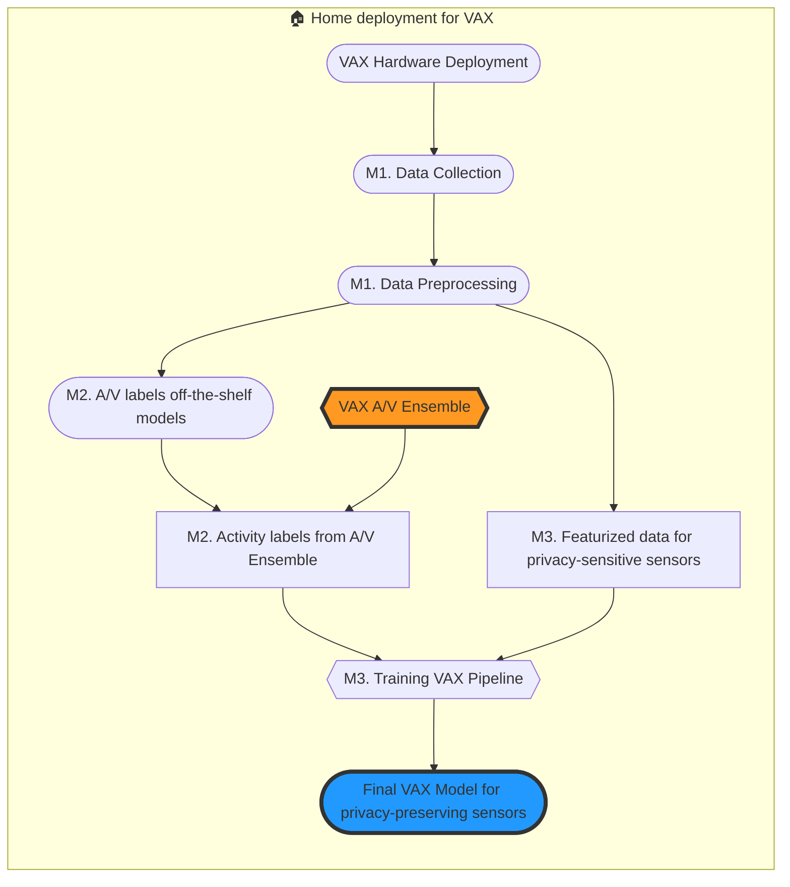

# VAX: Using Existing Video and Audio-based Activity Recognition Models to Bootstrap Privacy-Sensitive Sensors

TBD:[[paper (IMWUT 2023)](https://doi.org/10.1145/3610907)]
TBD:[[talk (IMWUT 2023)](https://www.youtube.com/)]
TBD:[[Project Video](https://www.youtube.com/)]
TBD:[[Installation Video](https://www.youtube.com/)]

**Authors:**
[[Prasoon Patidar](http://prasoonpatidar.com/)]
[[Mayank Goel](http://www.mayankgoel.com//)]
[[Yuvraj Agarwal](https://www.synergylabs.org/yuvraj/)]

**Abstract:**
The use of audio and video modalities for Human Activity Recognition (HAR) is common, given the richness of the data and
the availability of pre-trained ML models using a large corpus of labeled training data. However, audio and video
sensors also lead to significant consumer privacy concerns. Researchers have thus explored alternate modalities that are
less privacy-invasive such as mmWave doppler radars, IMUs, motion sensors. However, the key limitation of these
approaches is that most of them do not readily generalize across environments and require significant in-situ training
data. Recent work has proposed cross-modality transfer learning approaches to alleviate the lack of trained labeled data
with some success. In this paper, we generalize this concept to create a novel system called VAX (Video/Audio to ‘X’),
where training labels acquired from existing Video/Audio ML models are used to train ML models for a wide range of ‘X’
privacy-sensitive sensors. Notably, in VAX, once the ML models for the privacy-sensitive sensors are trained, with
little to no user involvement, the Audio/Video sensors can be removed altogether to protect the user’s privacy better.
We built and deployed VAX in ten participants’ homes while they performed 17 common activities of daily living. Our
evaluation results show that after training, VAX can use its onboard camera and microphone to detect approximately 15
out of 17 activities with an average accuracy of 90%. For these activities that can be detected using a camera and a
microphone, VAX trains a per-home model for the privacy-preserving sensors. These models (average accuracy = 84%)
require no in-situ user input. In addition, when VAX is augmented with just one labeled instance for the activities not
detected by the VAX A/V pipeline (∼2 out of 17), it can detect all 17 activities with an average accuracy of 84%. Our
results show that VAX is significantly better than a baseline supervised-learning approach of using one labeled instance
per activity in each home (average accuracy of 79%) since VAX reduces the user burden of providing activity labels by
8x (∼2 labels vs. 17 labels).

# Source Code Architecture

The source code for VAX is broken into 3 independent modules.

- **[M1. Data Collection](data_collection/):** Collecting data across variety of sensing
  modalities with real-time ground truth
  annotation. It also Preprocess collected data into activity instances, combining input across all
  sensors, and create visualization of activity instance raw data.
- **[M2. Generating (A/V) labels](generate_av_labels/):** Using raw A/V data for activity instances, and
  off-the-shelf pretrained models for activity recognition to generate A/V labels for collected instances.
- **[M3. Building self-supervised models (VAX pipeline)](vax_training/):** Given A/V labels using VAX A/V ensemble, and
  preprocessed raw data for sensors, train VAX pipeline for activity recognition using privacy sensitive sensors.

### Flowchart for training VAX Pipeline in a new home.

> **NOTE:**  VAX can be used directly to build in-situ models for privacy-sensitive sensors
> using public av_ensemble created by authors for activities mentioned in the paperwithout re-training on reference
> homes, unless we need to train for new set of activities not included in original paper.




[//]: # (### Flowchart for training AV Ensemble.)

[//]: # ()
[//]: # (```mermaid)

[//]: # (%%{init: {"flowchart": {"htmlLabels": false}} }%%)

[//]: # (flowchart LR)

[//]: # (    Home1&#40;["M1. Data Collection"]&#41;)

[//]: # (    Home1a&#40;["M1. Data Annotation"]&#41;)

[//]: # (    AV1&#40;["M3. A/V labels from off-the-shelf models"]&#41;)

[//]: # (    DP1&#40;["M2. Data Preprocessing"]&#41;)

[//]: # (    Home2&#40;["M1. Data Collection"]&#41;)

[//]: # (    Home2a&#40;["M1. Data Annotation"]&#41;)

[//]: # (    AV2&#40;["M3. A/V labels from off-the-shelf models"]&#41;)

[//]: # (    DP2&#40;["M2. Data Preprocessing"]&#41;)

[//]: # (    Homen&#40;["M1. Data Collection"]&#41;)

[//]: # (    Homena&#40;["M1. Data Annotation"]&#41;)

[//]: # (    AVn&#40;["M3. A/V labels from off-the-shelf models"]&#41;)

[//]: # (    DPn&#40;["M2. Data Preprocessing"]&#41;)

[//]: # (    avmodule{{M3. Public A/V Ensemble}})

[//]: # (    style avmodule fill:#f92,stroke:#333,stroke-width:4px)

[//]: # (    gt1&#40;Ground Truth Labels&#41;)

[//]: # (    style gt1 fill:#fff,stroke:#333,stroke-width:1px)

[//]: # (    gt2&#40;Ground Truth Labels&#41;)

[//]: # (    style gt2 fill:#fff,stroke:#333,stroke-width:1px)

[//]: # (    gtn&#40;Ground Truth Labels&#41;)

[//]: # (    style gtn fill:#fff,stroke:#333,stroke-width:1px)

[//]: # (    subgraph ""  )

[//]: # (      avmodule)

[//]: # (    end)

[//]: # (    subgraph "🏠 Reference Home 1"  )

[//]: # (      Home1 --> DP1 --> AV1 --> avmodule)

[//]: # (      DP1 --> avmodule)

[//]: # (      Home1a --> gt1 --> avmodule)

[//]: # (    end)

[//]: # (    subgraph "🏠 Reference Home 2"  )

[//]: # (      Home2 --> DP2 --> AV2 --> avmodule)

[//]: # (      DP2 --> avmodule)

[//]: # (      Home2a --> gt2 --> avmodule)

[//]: # (    end)

[//]: # (    subgraph "... 🏠 Reference Home n"  )

[//]: # (      Homen --> DPn --> AVn --> avmodule)

[//]: # (      DPn --> avmodule)

[//]: # (      Homena --> gtn --> avmodule)

[//]: # (    end)

[//]: # (```)

Each module, further is divided into 4 sections as follows:

- **Workbench Setup:** It consists of hardware/software requirement for each module, as well as expected input for each
  module.
- **Module Configuration:** It consists instruction for customizing module runtime for different settings and user
  needs.
- **Running Scripts:** This sections provides instructions for running module scripts.
- **Understanding Module Output:** Finally, this sections shows details on expected output after running the module.

For instructions and more details on each module. Please refer to instructions in individual module directories (Links
provided above).

## Using Individual Modules beyond VAX

Each of these modules can be run independent of each other and can be used for further research beyond VAX, like:

- **Data handling for privacy-sensitive sensors**: The first module (**Data collection**) can be used for any downstream tasks which utilizes sensing data across multiple
  sensing modalities.
- **Combining predictions from off-the-shelf models for any other task**: Module two (**Generating (A/V) labels**) can be used
  independent of collecting any data from
  privacy-sensitive sensors for combining multiple off-the-shelf HAR models for given set of pre-defined activities. Please look at Section 4.1 & 4.2 on HAR using off-the-shelf A/V models in the paper.

## Reference

```bibtex
@INPROCEEDINGS{patidar23vax,
    title = {VAX: Using Existing Video and Audio-based Activity Recognition Models to Bootstrap Privacy-Sensitive Sensors},
    author = {Prasoon Patidar and Mayank Goel and Yuvraj Agarwal},
    journal = {Proceedings of the ACM on Interactive, Mobile, Wearable and Ubiquitous Technologies}
    year = {2023},
    publisher = {ACM},
    address = {Cancun, Mexico},
    article = {117},
    volume = {7},
    number = {3},
    month = {9},
    doi = {https://doi.org/10.1145/3610907},
    pages = {213–224},
    numpages = {24},
    keywords = { ubiquitous sensing, privacy first design, human activity recognition},
}

