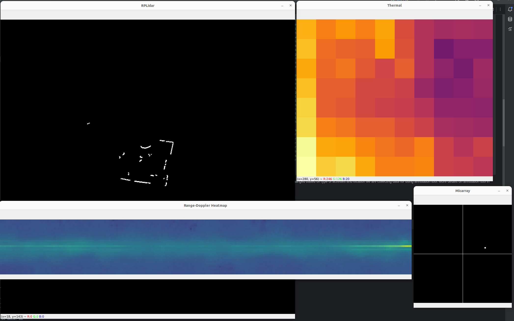
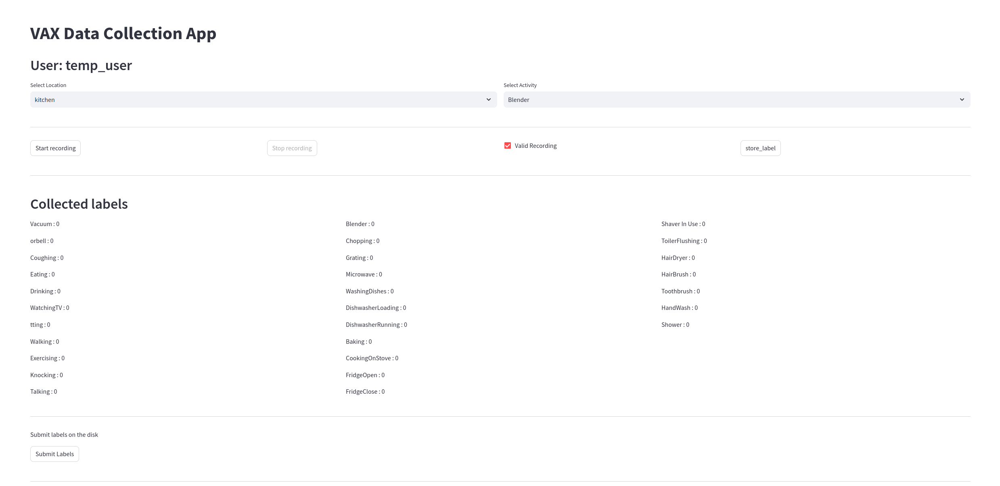

# VAX: Data Collection and Data Annotation

**About:** This module presents code for running data collection from audio, video (for A/V pipeline), and four privacy
preserving
sensors (Doppler, Lidar, ThermalCam, Micarray). It also consists of a data annotation tool, which can run in parallel to
data collection process to mark ground truth for instances in real time.

## 1. Workbench Setup

To collect data from A/V and privacy-sensitive sensors, we need corresponding sensor
hardware along with connectors (either USB or Ethernet Cables). Based on amount of sensors you wish to collect data
from, We might need power extension, Ethernet switches etc.

### Environment Setup:

### a. Clone (or Fork!) this repository

```shell
foo@bar:~$ git clone https://github.com/synergylabs/vax.git
foo@bar:~$ cd vax/data_collection
```

### b. Create a virtual environment and install python packages

We recommend using conda. We have tested our pipeline on `Ubuntu 22.04`, with `python 3.9`.

```shell
foo@bar:~$ conda create -n "vax_data_collection" python=3.9 -y
foo@bar:~$ conda activate vax_data_collection
foo@bar:~$ python -m pip install -r requirements.txt
foo@bar:~$ conda install -c conda-forge python-sounddevice
```

### Hardware and Software setup for data collection

VAX hardware consists of A/V sensor and five (four of which are available commercially) different type of privacy-sensitive sensors. For details on setup and
testing of individual sensors, go through [sensing submodule](sensing/). Once individual sensors are setup, we can run
data collections scripts.

### Setup for data annotation

There is not special setup required for data annotation scripts. The frontend for data annotation is written
with [streamlit library](streamlit.io) in python.

## Section B. Module Configuration

### Data collection configuration

Configuration for data collection can be changed
at [config/data_collection_config.json](config/data_collection_config.json) in this folder. Here are the options
available for given config.

```json lines
{
  // Name of the experiment, in general refering to data collected for a given user/home
  "name": "temp_user",
  "out_data_dir": "/vax/data_collection/cache",
  // Configs below consist of name of devices for a given sensing modalities, as sensing modalities can support multiple devices.
  // The value of device_<modality> should be same a folder in sensing/<modality>.
  // No need to change these values if devices used are from original paper.
  "device_doppler": "awr1642",
  "device_thermal": "flir",
  "device_micarray": "respeaker",
  "device_lidar2d": "rplidar_2d",
  "device_lidar3d": "cyglidar3d",
  // Maximum duration for data collection. This is to enable limit of total data collection time when collection is not 
  // happening in researcher supervision
  "duration_in_mins": 12000,
}
```

### Data annotation configuration

Data annotation configuration includes the location, and activity label for data collection. Here is the configuration
used in original paper.

```json5
{
  "kitchen": [
    "Blender",
    "Chopping",
    "Grating",
    "Microwave",
    "WashingDishes",
    "DishwasherLoading",
    "DishwasherRunning",
    "Baking",
    "CookingOnStove",
    "FridgeOpen",
    "FridgeClose"
  ],
  "livingroom": [
    "Vacuum",
    "Doorbell",
    "Coughing",
    "Eating",
    "Drinking",
    "WatchingTV",
    "Sitting",
    "Walking",
    "Exercising",
    "Knocking",
    "Talking"
  ],
  "bathroom": [
    "Shaver In Use",
    "ToilerFlushing",
    "HairDryer",
    "HairBrush",
    "Toothbrush",
    "HandWash",
    "Shower"
  ]
}
```

This can be changed based on type of activities and location we are collecting data for using annotation tool. More
details on annotation tool in next section.

## Section C. Running Scripts

### Start Data Recording

For ease of use, All sensors scripts are combined in a single bash file `start_data_recording.sh`. We use this file to
start data collection from all the sensors one by one automatically.

To start data recording across all sensors, all we need to run is following command. If you are running the script for the first time, you have to make it executable.

```shell
foo@bar:~$ sudo chmod +x start_data_recording.sh # Make the script executable
foo@bar:~$ ./start_data_recording.sh # Make sure to provide access when prompted with password
```

Once data collection is started, we will see
realtime visualization of collected data across all sensors (See below). More details on how data is being stored is in next
section.



### Stop Data Recording

| WARNING: Do not try to force shutdown scripts from terminal, or by killing the processes. This might lead to loss in collected data if write buffer is not flushed into memory from sensor process. |
|-----------------------------------------------------------------------------------------------------------------------------------------------------------------------------------------------------|

To stop data recording, you can do two things:
- To stop data recording from one sensor, you can just close the visualization. It will gracefully stop recording for given sensor, and this process can be done across all visualizations for stopping data recording.
- Other way is to run `stop_data_recording.sh` bash script. It will call `kill_sensors.py` python script, which will gracefully exit all sensor processes one by one. You can run this multiple times if you see any of the data collection process got stuck.

```shell
foo@bar:~$ sudo chmod +x stop_data_recording.sh # Make the script executable
foo@bar:~$ ./stop_data_recording.sh # Running this will open a new terminal to show status of closing multiple sensors
```

## Section D. Understanding Data Collection Output

All the recorded data is present in ```<out_data_dir>/<name>/{current_date}```, where ```out_data_dir``` and ```name``` 
are configured data collection configuration, and ```current_date``` is date of data collection in %Y%M%H format. 
- Each filename in this directory follows a format of ```<sensor_name>_%Y%m%d_%H%M%S.csv```, and consists of sensor 
observations at each timestamp in format ```{ts1} | {sensor_data_ts1} || {ts2} | {sensor_data_ts2} ...```. 
- This format where ```ts1``` and ```ts2``` are timestamps and ```sensor_data_ts1``` and ```sensor_data_ts2``` are sensor readings recorded
at those timestamps. 
- All sensor readings are stored as base64 encoded strings to allow for data capture and model training across multiple 
OS environments.
- We provide scripts to decode this data into python pickle files in [data_processing_visualization](../data_processing_visualization) directory.

## Section E. Understanding Data Annotation Process

While data collection is running in background, you can start data annotation server to start annotations in real time as follows
```shell
foo@bar:~$ streamlit run start_annotation_server.py # Running this will open a new terminal to show status of closing multiple sensors
```
It opens up a web interface as belows:


The location and activity configuration are picked from annotation config file as described in **Section B: Data annotation configuration**
. There are four buttons, whose function are as follows:
- **Start recording:** It stores the current timestamp as start of an activity instance for selected <location>,<activity>.
- **Stop recording:** It stores the current timestamp as start of an activity instance for selected <location>,<activity>.
> NOTE: Stop recording do not acutomatically save labeling information on disk. 
- **Store Label:** This mark as activity instance recorded. When an erroneous recording is made, you can keep the Valid Recording checkbox 
unchecked and submit label.
- **Submit Labels:** This finally saves your label on disk.

The final labeling file is stored in ```<out_data_dir>/<name>``` as defined in data_collection_config, which looks as follows:

```txt
start_time,end_time,location, activity, is_valid
20231001_061259.824750,20231001_061304.027504,kitchen, Grating, True
20231001_061259.824750,20231001_061304.027504,kitchen, Grating, False
20231001_062230.069619,20231001_062232.985464,kitchen, Grating, True
```

## Data Preprocessing and Visualization

Our data preprocessing step extracts raw data for collected instances for labels using annotation server, and also generates
visualizations for manual analysis. 

To run preprocessing step, run the command:

```shell
foo@bar:~$ python preprocess_data.py <RAW_DATA_DIR> # Running this will open a new terminal to show status of closing multiple sensors
```

where ```<RAW_DATA_DIR>``` is same as ```<out_data_dir>``` from data collection config. It is where all the collected raw data files,
and label files are stored. Preprocessed data is stored in ```<RAW_DATA_DIR>/processed_data``` in following directory structure.

```text
├── <ActivityID>
│   ├── <UserID>_<InstanceID>
│   │   ├── doppler_label_info.json
│   │   ├── doppler.pb                  # doppler data for all timestamps in an instance
│   │   ├── lidar2d_label_info.json
│   │   ├── lidar2d.pb                  # lidar2d data for all timestamps in an instance
│   │   ├── micarray_label_info.json
│   │   ├── micarray.pb                 # micarray data for all timestamps in an instance
│   │   ├── thermal_label_info.json
│   │   ├── thermal.pb                  # thermal data for all timestamps in an instance
│   │   └── viz                         
│   │       ├── doppler_viz.mp4         # doppler data visualization for instance
│   │       ├── lidar2d_viz.avi         # lidar2d data visualization for instance
│   │       ├── micarray_viz.avi        # micarray data visualization for instance
│   │       └── thermal_viz.mp4         # thermal data visualization for instance
│   └── .... more instance folders
            
├── .... more activity folders

```
> Note: Make sure you do not add any manual file into raw data directory

The processed data is finally used for training HAR models for "X" sensors.

## Reference

For more details, contact [prasoonpatidar@cmu.edu](prasoonpatidar@cmu.edu).

### If you find this module useful in your research, please consider cite:

```bibtex
@INPROCEEDINGS{patidar23vax,
    title = {VAX: Using Existing Video and Audio-based Activity Recognition Models to Bootstrap Privacy-Sensitive Sensors},
    author = {Prasoon Patidar and Mayank Goel and Yuvraj Agarwal},
    journal = {Proceedings of the ACM on Interactive, Mobile, Wearable and Ubiquitous Technologies}
    year = {2023},
    publisher = {ACM},
    address = {Cancun, Mexico},
    article = {117},
    volume = {7},
    number = {3},
    month = {9},
    doi = {https://doi.org/10.1145/3610907},
    pages = {213–224},
    numpages = {24},
    keywords = { ubiquitous sensing, privacy first design, human activity recognition},
}
```
